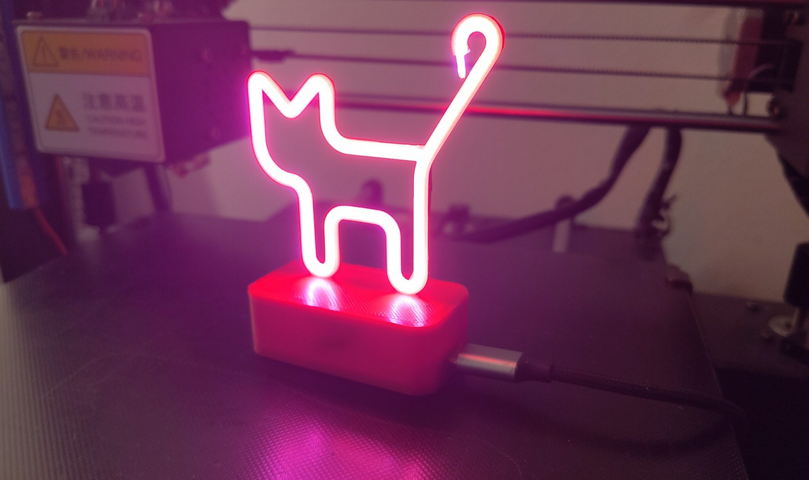

# MeowMeow - Cat Lamp Firmware 😺🐾

I am your purring firmware cat: lean PlatformIO firmware with a cat portal,
web UI, and LED lamp. I nap in `src/main.cpp` and claim my territory as a SoftAP.
Bring treats (and a USB cable). Meow. 🐈‍⬛✨

<p align="center">
  
</p>

Prefer ready-to-flash binaries? Grab the latest `.bin` from
https://github.com/Friedjof/MeowMeow/releases and flash it with your favorite
tool. 🐾
You can also flash directly in Chrome via https://esptool.spacehuhn.com/ using
the serial port. ⚡

## Info ℹ️

> 🐾 **Who I am:** ESP32 firmware that boots an open WiFi and serves a small
>    web UI to control the lamp LED.
> 🧶 **Why I exist:** Start fast, stay lean, ship a UI that is embedded in
>    firmware.
> 🥣 **What I need:** PlatformIO Core, an ESP32 board, USB cable; Node.js only
>    if you tweak the web UI; Python 3 for header generation scripts.

## What I can do (cat view) 😼

- 🌐 SoftAP + DNS captive portal so you land on my page.
- 💡 Lamp LED on/off plus effects: static, blink, purr, bzzz.
- 🧩 JSON API for status, settings, and mode.
- 🧪 Multi-target builds: esp32, esp32c3, esp32s3, esp32c6.
- 🧶 Vite UI embedded as C headers in firmware.
- 🧺 Optional filesystem via `data-template/` and Makefile targets.

## Quickstart 🐾

1) Setup:

```bash
./tools/setup.sh
```

2) Build:

```bash
make build BOARD=esp32
```

3) Flash:

```bash
make flash
```

4) Monitor (optional):

```bash
make monitor
```

Prefer PlatformIO CLI?

```bash
pio run -e esp32
pio run -e esp32 -t upload
pio device monitor
```

## Connect to my territory 🌐

I start an open WiFi (SSID: `MeowMeow`). Connect and open
`http://192.168.4.1`. Android usually shows the portal automatically; if not,
open it manually. Then tap a paw to toggle the lamp. 🐾

## Hardware setup (my wiring nap) 🔧

I run a 3V LED filament from the ESP32-C3 3.3V rail and switch it with a 2N2222
transistor:

- LED filament needs 3V; ESP32-C3 provides 3.3V.
- 2N2222 wiring:
  - E (emitter) -> GND
  - B (base) -> GPIO4 / D2
  - C (collector) -> 47 ohm resistor -> LED filament negative
- LED filament positive -> 3.3V
- Common ground shared between ESP32 and filament

## API pawprint 🐾

- `GET /api/paw` returns status:
  `{"led_on":true,"uptime_s":123,"ssid":"MeowMeow","mode":"static"}`
- `POST /api/paw` sets the lamp state via `state` or raw body.
  Accepts: `on`, `off`, `toggle`, `true`, `false`, `1`, `0`.
- `GET /api/settings` returns saved settings JSON.
- `POST /api/settings` accepts JSON with:
  `wifi_enabled`, `wifi_ssid`, `wifi_password`, `mqtt_enabled`, `mqtt_host`,
  `mqtt_port`, `mqtt_topic`, `led_pin`.
- `POST /api/mode` accepts `{"mode":"static"}` with:
  `static`, `blink`, `purr`, `bzzz`.

Settings live in NVS (Preferences). WiFi and MQTT fields are stored but not
connected by default in the current firmware. 🐱‍👓

## Firmware tune-up 🛠️

Key defaults in `src/main.cpp`:

```cpp
const int DEFAULT_LED_PIN = LED_BUILTIN;
const uint8_t LED_ON_LEVEL = HIGH;
const char* AP_SSID = "MeowMeow";
const char* DEFAULT_MODE = "static";
```

## Web UI development 🧵

The UI in `web/` is built into C headers and embedded in the firmware.

```bash
make web-headers
```

Or run from the web folder:

```bash
make -C web dev
make -C web build-esp
```

## Filesystem (optional) 📁

- `data-template/` holds the filesystem seed.
- `./tools/setup.sh` copies it to `data/` on first setup.
- Upload with `make deploy-fs` or `pio run -t uploadfs`.

## Partitions 🧱

`platformio.ini` uses `boards/min_spiffs.csv` for OTA and a small FS.
Edit the CSV in `boards/` if you need more space. 🐾

## Tiny cat details ✨

- I meow on boot over Serial at 115200 and announce my IP. 😺
- I catch OS portal probes like `/generate_204`, `fwlink`, `hotspot-detect.html`.
- `make deploy-flash` does web UI, firmware, and filesystem in one pounce.
- I like short, non-blocking loops so I stay responsive. 🐈
- My UI lives in `lib/WebService/web_files.h` after `make web-headers`.

## Docs and notes 📌

- README images live in `docs/assets/` and are linked by relative paths.
- Printable 3D STL files: https://www.printables.com/model/1472283-neon-cat-lamp-out-of-led-filament
- For AI agents: [AGENTS.md](AGENTS.md).
- Short walkthrough: [QUICKSTART.md](QUICKSTART.md).
